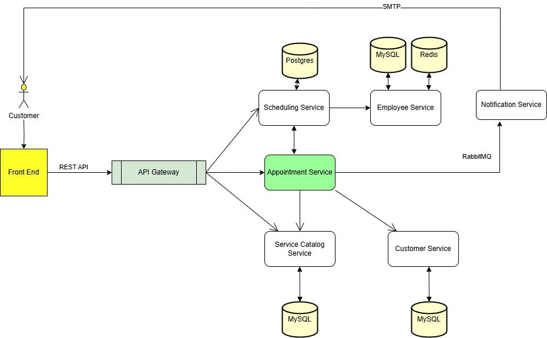

# 📊 Microservices System - Analysis and Design

Tài liệu này mô tả quy trình phân tích và thiết kế cho hệ thống đặt lịch hẹn trực tuyến dựa trên kiến trúc microservices.

---

## 1. 🎯 Problem Statement

_Hệ thống cung cấp một nền tảng tập trung, tự động hóa cho phép khách hàng đặt, quản lý (đặt lại/hủy) và nhận lời nhắc cho các cuộc hẹn với nhiều nhà cung cấp dịch vụ khác nhau. Đối với doanh nghiệp, nó giúp tối ưu hóa việc quản lý lịch trình, giảm thiểu tình trạng khách không đến thông qua lời nhắc tự động và có khả năng tối ưu hóa việc sử dụng nhân viên._

- **Đối tượng sử dụng**
    - **Khách hàng**: Những người cần sử dụng các dịch vụ như tư vấn, khám bệnh, chăm sóc sắc đẹp, v.v., và muốn đặt lịch hẹn trực tuyến.
    - **Nhân viên/chuyên viên cung cấp dịch vụ**: Những người thực hiện các dịch vụ mà khách hàng đã đăng ký (ví dụ: bác sĩ, tư vấn viên, chuyên gia chăm sóc sắc đẹp).
    - **Quản trị viên**: Người theo dõi, quản lý các lịch hẹn và hoạt động của nhân viên.

- **Mục tiêu chính của hệ thống**
    - **Khách hàng**:
        - Đặt lịch hẹn trực tuyến với dịch vụ yêu cầu.
        - Chọn thời gian, dịch vụ và nhân viên cung cấp dịch vụ (nếu cần).
        - Nhận thông báo xác nhận lịch hẹn và lời nhắc trước lịch hẹn.
        - Thay đổi hoặc hủy lịch hẹn (nếu cần).

- **Loại dữ liệu nào được xử lý?**
    - **Dữ liệu người dùng**: Thông tin khách hàng, nhân viên, lịch sử đặt lịch hẹn, thông tin liên hệ (email, SMS).
    - **Dữ liệu lịch hẹn**: Thời gian đặt lịch, dịch vụ yêu cầu, nhân viên cung cấp dịch vụ, trạng thái lịch hẹn (đã xác nhận, thay đổi, hủy).
    - **Dữ liệu thông báo**: Email và tin nhắn SMS xác nhận lịch hẹn, lời nhắc lịch hẹn, thông báo hủy lịch hẹn.
    - **Dữ liệu phản hồi**: Đánh giá từ khách hàng về chất lượng dịch vụ sau khi hoàn thành.

> Ví dụ sử dụng:
> - **Một khách hàng** cần đặt lịch hẹn cho một cuộc khám sức khỏe. 
Họ chọn dịch vụ, thời gian và chuyên gia có sẵn. Sau khi xác nhận chi
tiết, họ nhận được xác nhận qua SMS hoặc email. Trước khi đến lịch hẹn,
hệ thống sẽ gửi lời nhắc. Nếu khách hàng cần thay đổi, họ có thể điều
chỉnh lịch hẹn trực tuyến. Sau khi dịch vụ hoàn tất, hệ thống sẽ xử lý phản hồi và xuất hoá đơn.

---

## 2. 🧩 Identified Microservices

Liệt kê các microservices trong hệ thống 

| Service Name              | Responsibility                                                                  | Tech Stack          |
|---------------------------|---------------------------------------------------------------------------------|---------------------|
| appointment-service       | Quản lý việc đặt lịch hẹn, xác nhận, thay đổi và hủy lịch                       | Java Spring Boot    |
| scheduling-service        | Quản lý lịch hẹn, truy xuất nhân viên rảnh                                      | Java Spring Boot    |
| notification-service      | Gửi thông báo xác nhận, nhắc nhở lịch hẹn, thông báo hủy lịch hẹn qua email/SMS | Java Spring Boot    |
| service catalog - service | Quản lý danh mục dịch vụ                                                        | Java Spring Boot    |
| customer - service        | Quản lý thông tin khách hàng                                                    | Java Spring Boot    |
| employee -  service       | Quản lý thông tin, lịch làm việc nhân viên                                      | Nginx / Spring Boot |

---

## 3. 🔄 Service Communication

Mô tả cách thức giao tiếp giữa các dịch vụ trong hệ thống:
### Giao tiếp qua Gateway
- **Gateway ⇄ appointment-service** (REST)
    - Gửi yêu cầu đặt lịch, cập nhật hoặc hủy lịch hẹn từ người dùng đến dịch vụ appointment.

- **Gateway ⇄ scheduling-service** (REST)
    - Gateway gửi yêu cầu đến scheduling-service để lấy danh sách lịch rảnh nhân viên

- **Gateway ⇄ service catalog-service** (RabbitMQ)
    - Gateway gửi yêu cầu đến service catalog-service để lấy danh sách dịch vụ đang có

- **Internal: appointment-service ⇄ customer-service** (REST, optional)
    - Dịch vụ appointment-service có thể giao tiếp với customer-service để lấy thông tin người dùng

- **Internal: appointment-service ⇄ notification-service** (RabbitMQ)
    - Dịch vụ appointment-service có thể giao tiếp với notification-service để gửi thông báo xác nhận hoặc nhắc nhở lịch hẹn qua RabbitMQ. Việc sử dụng RabbitMQ giúp tăng cường hiệu suất và giảm độ trễ khi gửi thông báo.

- **Internal: appointment-service ⇄ scheduling-service** (REST)
    - Dịch vụ appointment-service có thể giao tiếp với scheduling-service để lưu thông tin lịch hẹn-
**Internal: scheduling-service ⇄ employee-service** (REST)
    - Dịch vụ scheduling-service có thể giao tiếp với employee-service để yêu cầu lấy danh sách nhân viên, thông tin lịch làm

---

## 4. 🗂️ Data Design

### Xác định Data Structure

- **Customer Service (sử dụng MySQL): Quản lý thông tin về khách hàng**
  - **Customer**: tên, ngày sinh, email, giới tính, địa chỉ, số điện thoại
- **Employee-service (sử dụng PostgreSQL): Quản lý thông tin nhân viên và lịch làm việc**
  - **Employee**: tên, ngày sinh, email, giới tính, địa chỉ, số điện thoại, kiểu nhân viên, bộ phận, chuyên môn, ngày vào làm, lương, trạng thái, lịch làm việc
  - **WorkSchedule**: Employee, ngày làm, giờ bắt đầu, giờ kết thúc, ghi chú
- **Scheduling-service : (sử dụng Postgres): Quản lý lịch hẹn, bao gồm các thông tin về dịch vụ và thời gian**
  - **Appointment**: khách hàng, nhân viên phòng khám, dịch vụ khám, thời gian khám, trạng thái (đã đặt, đã hủy, đã xác nhận), thời gian tạo , thời gian cập nhật, địa chỉ
- **Notification-service : Gửi thông báo qua email hoặc SMS**
  - **Notification**: tên, khách hàng, lịch hẹn, type (Xác nhận, Nhắc nhở, Hủy), nội dung, trạng thái, thời gian gửi
- **Service Catalog-service (sử dụng MySQL): Quản lý các danh mục dịch vụ của hệ thống**
-  **StaffCatalog**:tên dịch vụ, mô tả, thể loại, giá tiền, thời lượng

### Thiết kế biểu đồ lớp cho các service:

- **Customer Service**:  

- **Employee-service**:  

- **Scheduling-service**:  

- **Service Catalog-service**:
    

### Thiết kế cơ sở dữ liệu:

- **Customer Service**:  

- **Employee-service**:  

- **Scheduling-service**:  

- **Notification-service**:  
    
  
- **Service Catalog-service**:  

## 6. 📦 Deployment Plan

### Mô tả
- **Sử dụng docker-compose để quản lý môi trường cục bộ**:
    - Tất cả các dịch vụ (user-service, task-service, team-service, notification-service) sẽ được chạy trong các container riêng biệt, được quản lý tập trung bằng `docker-compose`.
    - Mỗi dịch vụ có Dockerfile riêng.
- **Cấu hình môi trường được lưu trong file `.env`**:
    - File `.env` chứa các biến môi trường cần thiết, bao gồm:
    - 
        - `EMPLOYEE_SERVICE=http://user-service:5001`: URL của User Service.
        - `SCHEDULING_SERVICE=http://team-service:5002`: URL của Team Service.
        - `APPOINTMENT_SERVICE=http://task-service:5003`: URL của Task Service.
        - `NOTIFICATION_SERVICE=http://notification-service:5004`: URL của Notification Service.

## 7. 🎨 Architecture Diagram

## ✅ Summary
Kiến trúc microservices giúp hệ thống dễ dàng mở rộng, bảo trì và đảm bảo tính an toàn, bảo mật cao trong quá trình quản lý công việc

- Mỗi chức năng chính (appointment, notification, scheduling, ...) được tách riêng giúp dễ bảo trì và triển khai độc lập.
- Scalability: Hỗ trợ mở rộng linh hoạt từng dịch vụ riêng biệt khi cần thiết.
- Kiểm soát phân quyền: Hệ thống phân quyền rõ ràng, chỉ người có quyền quản trị mới có thể tạo và giao công việc.
- Tích hợp thông báo: Notification Service gửi email giúp người dùng luôn nhận được thông báo khi có công việc mới hoặc thay đổi quan trọng.

