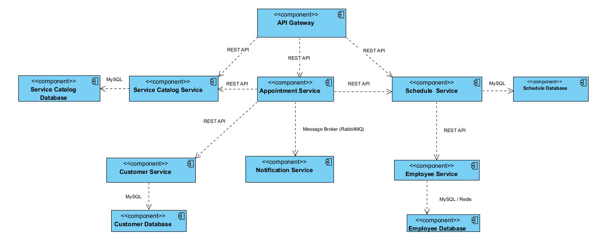

# Kiến trúc hệ thống

## Tổng quan
Hệ thống đặt lịch hẹn trực tuyến được xây dựng dựa trên kiến trúc **microservices**, nhằm mục tiêu cung cấp một giải pháp **linh hoạt**, **dễ mở rộng** và **dễ bảo trì**
Người dùng có thể đặt lịch hẹn trước cho một dịch vụ nào đó và nhận được **thông báo xác nhận đặt phòng theo thời gian thực**. Các thành phần chính được thiết kế thành các dịch vụ nhỏ, giao tiếp với nhau thông qua **REST API** , đảm bảo:
* **Phân tách rõ ràng chức năng** giữa các dịch vụ như người dùng, nhân viên, thông báo và lịch hẹn.
* **Tối ưu khả năng mở rộng** riêng lẻ theo từng dịch vụ (ví dụ: Appointment Service có thể scale độc lập).
* **Đảm bảo độ tin cậy**: lỗi của một service không ảnh hưởng đến toàn hệ thống.
* **Dễ bảo trì và phát triển** từng phần độc lập.
* **Linh hoạt công nghệ**: mỗi service có thể dùng công nghệ khác nhau.
---

## Thành phần hệ thống

| Tên dịch vụ                 | Loại dịch vụ         | Vai trò chính                                                     |
|-----------------------------|----------------------|-------------------------------------------------------------------|
| **Appointment Service**     | Task Service         | Nhận yêu cầu đặt lịch sau đó lưu thông tin, gửi yêu cầu thông báo |
| **Scheduling Service**      | Task Service         | Quản lý thông tin lịch hẹn, kiểm tra lịch rảnh của nhân viên      |
| **Employee Service**        | Entity Service       | Quản lý thông tin thông tin nhân viên, lịch làm việc              |
| **Customer Service**        | Entity Service       | Quản lý thông tin thông tin khách hàng                            |
| **Notification Service**    | Utility Service      | Gửi email xác nhận đặt phòng hoặc thông báo lỗi                   |
| **Service Catalog Service** | Entity Service       | Quản lý thông tin thông tin dịch vụ                               |
| **API Gateway**             | Infrastructure       | Nhận yêu cầu từ frontend và định tuyến đến các service tương ứng  |
| **Frontend (FE)**           | Giao diện người dùng | Giao tiếp với API Gateway, hiển thị kết quả đặt phòng             |

---
## Giao tiếp giữa các thành phần

| Giao tiếp                              | Hình thức      | Ghi chú                            |
|----------------------------------------|----------------|------------------------------------|
| Gateway ⇄ Appointment Service          | REST API       | Yêu cầu đặt lịch hẹn               |
| Gateway ⇄ Scheduling Service           | REST API       | Truy xuất danh sách nhân viên rảnh |
| Gateway ⇄ Service Catalog Service      | REST API       | Truy xuất danh sách dịch vụ        |
| Appointment Service ⇄ Customer Service | REST API       | Yêu cầu lấy thông tin người dùng   |
| Appointment Service ⇄ Schedule Service | REST API       | Yêu cầu lưu thông tin lịch hẹn     |
| Appointment Service ⇄ Notification     | Message Broker | Yêu cầu gửi thông báo              |
| Scheduling ⇄ Employee Service          | REST API       | Yêu cầu lấy danh sách nhân viên    |

## Luồng dữ liệu
1. Hiển thị danh sách dịch vụ cho khách hàng
   - API Gateway định tuyến request tới Service Catalog Service yêu cầu lấy danh sách dịch vụ đang có
2. Khách hàng chọn dịch vụ , chọn thời gian
   - API Gateway định tuyến request tới Scheduling Service yêu cầu lấy danh sách nhân viên rảnh theo khung giờ
   - Scheduling Service gọi tới Employee Service để lấy danh sách nhân viên rồi kiểm tra
3. Khách hàng chọn đặt lịch
   - API Gateway định tuyến request tới Appointment Service yêu cầu đặt lịch
   - Appointment Service gọi đến Customer Service để lấy thông tin chuẩn bị dữ liệu cho thông báo
   - Appointment Service dùng message broker để đẩy vào topic cho Notification Service lắng nghe để gửi gmail xác nhận cho người dùng
   - Appointment Service gọi đến Scheduling Service để yêu cầu lưu thông tin lịch hẹn

### 4.2. Cơ sở dữ liệu nội bộ
    - Customer-service, service-catalog-service sử dụng MySQL để lưu trữ dữ liệu về nhân viên và danh mục sản phẩm
    - service-catalog-service sử dụng Postgres để lưu trữ lịch hẹn
    - employee-service sử dụng MySQL / Redis để lưu thông tin nhân viên, lịch làm

### 4.3. Phụ thuộc bên ngoài
    - notification-service sử dụng SMTP server để gửi email.

## Diagram

## 6. Scalability & Fault Tolerance

    - Hệ thống được thiết kế theo kiến trúc microservices, cho phép mỗi dịch vụ được triển khai và mở rộng độc lập, phù hợp với nhu cầu xử lý thực tế (horizontal scaling).
    - Sử dụng Docker và Docker Compose giúp triển khai linh hoạt, dễ dàng tăng số lượng instance cho các dịch vụ có tải cao như appoinment-service hoặc notification-service.
    - API Gateway có thể tích hợp với các công cụ cân bằng tải (load balancer) để phân phối đều lưu lượng đến các instance dịch vụ.
    - Hệ thống có thể tích hợp cơ chế retry và fallback trong giao tiếp giữa các service (ví dụ: khi notification-service gửi email thất bại, có thể retry hoặc ghi log để xử lý sau).
    - Việc sử dụng cơ sở dữ liệu riêng biệt cho từng service giúp tăng tính chịu lỗi, nếu một dịch vụ gặp sự cố, các dịch vụ còn lại vẫn tiếp tục hoạt động.